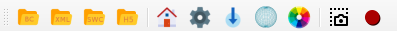
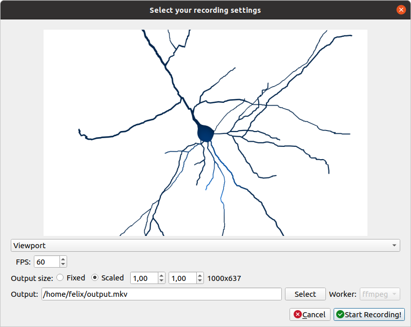
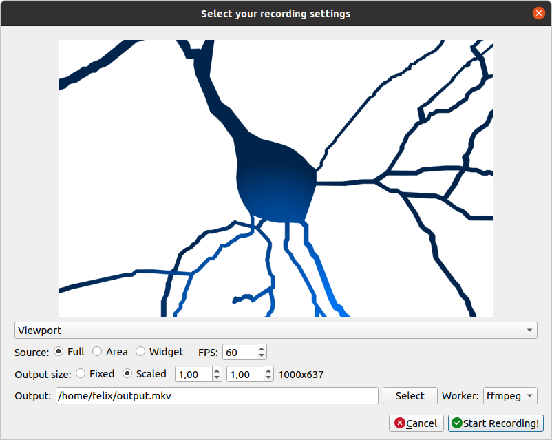

============================
NeuroTessMesh User Interface
============================

---------------------------------
NeuroTessMesh Application Toolbar
---------------------------------

The application bar presents several icons to perform actions such as opening datasets, and showing or hiding configuration panels. The user can see the menu entries to associate each icon with function (:numref:`fig1`).

.. _fig1:

   NeuroTessMesh application tool bar. 
   
^^^^
File
^^^^
   
The first three icons loads an scene or neuron morphology. The neuron morphology must be described following the `SWC format`_ Scenes composed of severan neurons must be described using an XML specific format (described in the **file formats** section). 

  - **Open BlueConfig**: Opens neuron morphology in BlueConfig format.
  - **Open XML scene**: Opens a scene composed of several neurons. 
  - **Open SWC**: Opens a neuron morphology in SWC format. 
  
.. _SWC format: http://www.neuronland.org/NLMorphologyConverter/MorphologyFormats/SWC/Spec.html

^^^^^^^^^^^^^
Configuration
^^^^^^^^^^^^^

  - **Tessellation params**:
  
      - **Subdivision level**: Maximum level of subdivisions for the visualization. The valid values are in the range of 1 and 30. 
      - **Distance threshold**: Further distance to witch the subdivision is applied. The valid values are 0 to 1, 1 being the camera maximum visibility distance. 
      - **Tangent smoothing**: Scales the modulus of the orientation vectors applied to smooth the neurite trajectories. The valid values are 0 to 1, 0 being no smoothing and 1 the maximum smoothing. 
      
  - **Tessellation criteria**: Select the tessellation criteria applied in the subdivision.
  
      - **Homogeneous**: Same level of subdivision for all the mesh. 
      - **Camera distance**: The level of subdivisions is higher near the camera. 

.. _fig2:

   Configuration panel.

^^^^^^^^^^^^
Render panel
^^^^^^^^^^^^

  - **Color**: Select the color for each of the following entities.
  
      - **Background**
      - **Neuron**
      - **Selected neuron**
      
  - **Render piece selection**: select the parts (full, only soma, only neurites or  nothing) of the neuron to visualize. This selection can be done independently for each of the following  types of neurons.  
  
      - **Neuron**
      - **Selected neuron**

.. _fig3:

   Render panel.

^^^^^^^^^^^^^^^^^^^
Edit and save panel
^^^^^^^^^^^^^^^^^^^

  - **Select Neuron**: select the target neuron from a list of the neurons in the current scene.  
  - **Parameters**: different parameters to modify the reconstructed neuronal mesh.  
  
      - **Radius factor**: scales the radius of the initial sphere used to generate the soma. [0-1].  
      - **Neurite [n] factor**: factor that multiplies the distance from the neurite n to the soma.  0: Distance=0 (on the soma surface). 1: Current distance*2  
      
  - **Save button**: save the actual mesh reconstruction  to "obj" file. 

.. _fig4:

   Edit and save panel.

^^^^^^^^^^^^^^^^^^^^^
Scene camera controls
^^^^^^^^^^^^^^^^^^^^^

The camera can be manipulated using the mouse. The movements are:
  - Rotation: mouse left button + mouse movement. 
  - Translation: mouse scroll button + mouse movement. 
  - Zoom: mouse scroll to zoom in and out.

--------
Recorder
--------

The recording feature can be activated using the **Options** menu or by clicking the Recorder icon in the toolbar. The user will be presented with the recorder configuration dialog (:numref:`figA`).

.. _figA:

   Recorder standard configuration dialog. 

The recorder will generate a mp4 video if the media application **ffmpeg** is detected and available, if not the generated output will be individual frames. The frames per second of the output can be specified here. The user can specify the input of the recording, being the main application window or just the 3D viewport.

In the advanced configuration dialog (:numref:`figB`) the user can modify additional options as which worker (video or frames) to use to generate the output. The advanced configuration dialog can be enabled by checking the **Advanced recorder options checkbox** in the Options menu).

.. _figB:

   Recorder advanced configuration dialog. 

Using the advanced configuration an area of the application can be selected for recording as input.

If the output is a video the user can specify the location of the generated file using the Select button. If the output is a sequence of frames the user can specify the destination directory using the Select button in the dialog.

The dimensions of the output are shown and can be modified with the scale options.

While the recorder is working the associated toolbar button will remain down and the user must click it again to stop it. The recorder can also be stopped using the Recorder button in the Tools menu or the keyboard shortcut **Ctrl + R**.

.. warning::
    To record a video the system must have **ffmpeg** installed, preferably with Nvidia hardware acceleration. 
    If ffmpeg is not available in the system only the **images** worker will be available in the recorder.

------------------
Keys and shortcuts
------------------

  - **Open BlueConfig**: Ctrl + Shift + B
  - **Open XML Scene**: Ctrl + Shift + X
  - **Open SWC**: Ctrl + Shift + S
  - **Exit application**: Ctrl + Shift + Q
  - **Home (reset view)**: Ctrl + H
  - **Update on idle**: Ctrl + I
  - **Show FPS on idle update**: Ctrl + S
  - **Show wireframe**: Ctrl + W
  - **Render options**: Ctrl + B
  - **Edit and save**: Ctrl + M
  - **Configuration**: Ctrl + C
  - **Toggle Recorder**: Ctrl + R

