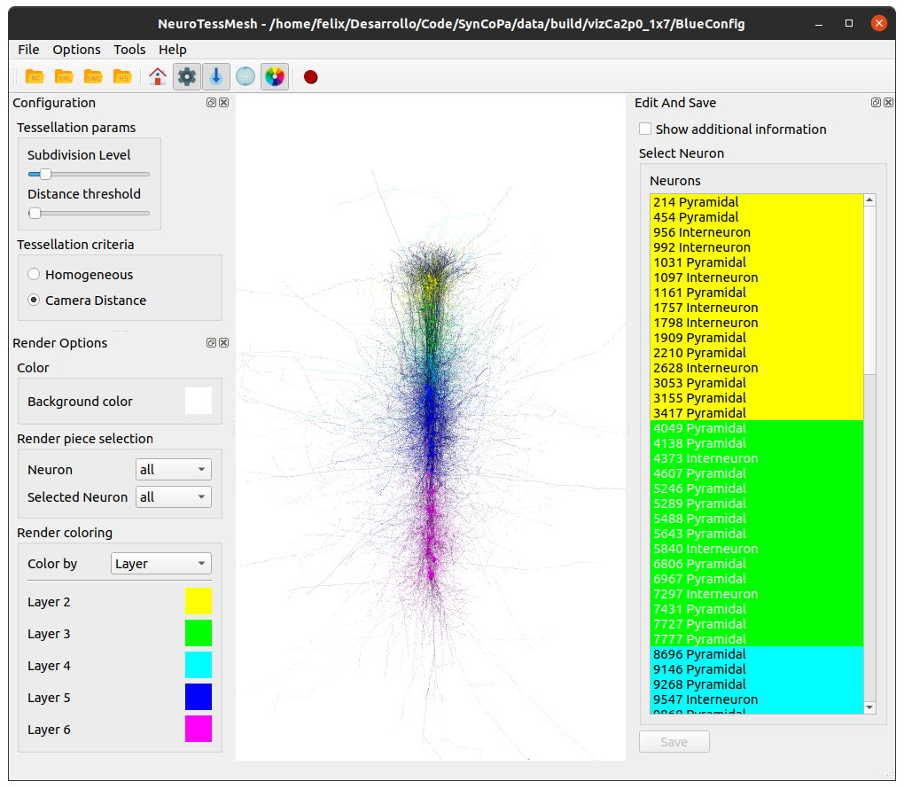

============================
NeuroTessMesh User Interface
============================

In this section we'll describe the different panels and configuration options in the main dialog. 

.. _fig0:

   NeuronTessMess application main window.

---------------------------------
NeuroTessMesh Application Toolbar
---------------------------------

The application bar presents several icons to perform actions such as opening datasets, and showing or hiding configuration panels. The user can see the menu entries to associate each icon with function (:numref:`fig1`).

.. _fig1:

.. figure:: images/NTMimage001.png
   :alt: NeuroTessMesh application toolbar
   :align: center
   :width: 381
   :scale: 100%

   NeuroTessMesh application tool bar. 
   
^^^^
File
^^^^
   
The first four icons loads an scene or neuron morphology. The neuron morphology must be described following the `SWC format`_ Scenes composed of severan neurons must be described using an XML specific format (described in the **file formats** section). 

  - **Open BlueConfig**: Opens neuron morphology in BlueConfig format.
  - **Open XML scene**: Opens a scene composed of several neurons. 
  - **Open SWC**: Opens a neuron morphology in SWC format. 
  - **Open HDF5**: Opens neuron morphology in HDF5 format.
  
.. _SWC format: http://www.neuronland.org/NLMorphologyConverter/MorphologyFormats/SWC/Spec.html

^^^^^^^^^^^^^
Configuration
^^^^^^^^^^^^^

  - **Tessellation params**:
  
      - **Subdivision level**: Maximum level of subdivisions for the visualization. The valid values are in the range of 1 and 30. 
      - **Distance threshold**: Further distance to witch the subdivision is applied. The valid values are 0 to 1, 1 being the camera maximum visibility distance. 
      - **Tangent smoothing**: Scales the modulus of the orientation vectors applied to smooth the neurite trajectories. The valid values are 0 to 1, 0 being no smoothing and 1 the maximum smoothing. 
      
  - **Tessellation criteria**: Select the tessellation criteria applied in the subdivision.
  
      - **Homogeneous**: Same level of subdivision for all the mesh. 
      - **Camera distance**: The level of subdivisions is higher near the camera. 

.. _fig2:

.. figure:: images/NTMimage002.png
   :alt: Configuration panel
   :align: center
   :width: 252
   :scale: 80%

   Configuration panel.

^^^^^^^^^^^^
Render panel
^^^^^^^^^^^^

  - **Color**: Selects the background color for the scene view.
  
      
  - **Render piece selection**: Select the parts (full, only soma, only neurites) of the neuron to visualize. This selection can be done independently for each of the following types of neurons.  
  
      - **Neuron**
      - **Selected neuron**

The **Selected**, and **Unselected** neurons refer to the entities selected via ZeroEQ selection in other applications.

  - **Render coloring**: Selects the coloring method for the current scene. There are four coloring methods:

    - **Selection**: Color neurons by selection.
    - **Morphology**: Color neurons by morphology type.
    - **Layer**: Color neurons by layer.
    - **Function**: Color neurons by function type.

The render coloring method selected will affect the colors shown in the neuron list and edit panel. The color for each possible value can be modified by clicking in the colored box right next to the value name.

.. _fig3:

.. figure:: images/NTMimage003.png
   :alt: Render panel
   :align: center
   :width: 322
   :scale: 80%

   Render panel.

^^^^^^^^^^^^^^^^^^^
Edit and save panel
^^^^^^^^^^^^^^^^^^^

The **edit and save** panel list the neurons in the scene colored by the selected coloring method in the render panel. The neurons are listed in this panel using the pattern *(id) (morphological type)* in its naming.

  - **Show additional information**: adds the function and layer information to the neuron name (if available).
  - **Select Neuron**: select the target neuron from a list of the neurons in the current scene.  
  - **Parameters**: different parameters to modify the reconstructed neuronal mesh.  
  
      - **Radius factor**: scales the radius of the initial sphere used to generate the soma. [0-1].  
      - **Neurite [n] factor**: factor that multiplies the distance from the neurite n to the soma.  0: Distance=0 (on the soma surface). 1: Current distance*2  
      
  - **Save button**: save the actual mesh reconstruction  to "obj" file. 

.. _fig4:

.. figure:: images/NTMimage004.png
   :alt: Edit and save panel
   :align: center
   :width: 1020
   :scale: 60%

   Edit and save panel (left).

.. Commented out until player is activated again.  
   ^^^^^^^^^^^^
   Player panel
   ^^^^^^^^^^^^

   The player panel is only enabled if the dataset loaded have neuron spikes information (currently only BlueConfig datasets). The panel contains the player options and the playing position bar.

   The player configuration options are:
     - **Step delta time**: Amount of increment per simulation step. 
     - **Steps/second**: Number of steps per second.

   .. _figa4:

   .. figure:: images/NTMimage013.png
      :alt: Spike activation simulation.
      :align: center
      :width: 1020
      :scale: 60%

      Spike activation simulation.

   When a dataset has spike information the **player** panel allow the user to **play**, **stop** and position the simulation at the selected time. When a neuron activates it changes color to red, and then decays to the current neuron color. 

   .. warning::
      Simulations are most visible if the render is only displaying the soma because when activated the whole neuron will change color.

^^^^^^^^^^^^^^^^^^^^^
Scene camera controls
^^^^^^^^^^^^^^^^^^^^^

The camera can be manipulated using the mouse. The movements are:
  - **Rotation:** mouse left button + mouse movement. 
  - **Translation:** mouse scroll button (middle button) + mouse movement. 
  - **Zoom:** mouse scroll to zoom in and out.

---------------------------------
NeuroTessMesh Menu Toolbar
---------------------------------

^^^^^^^^^
File menu
^^^^^^^^^
- **Open BlueConfig**: Opens neuron morphology in BlueConfig format.
- **Open XML scene**: Opens a scene composed of several neurons.
- **Open SWC**: Opens a neuron morphology in SWC format.
- **Load camera positions**: Loads a JSON file with the description of camera positions.
- **Save camera positions**: Saves the currently stored camera positions to a JSON file.

^^^^^^^^^^^^
Options menu
^^^^^^^^^^^^
- **Home**: Reset view perspective to original values of focus and camera distance.
- **Add camera position**: Adds the current camera position to the list of positions with a name given by the user (:numref:`figC`).

.. _figC:

   Camera position name dialog.

- **Remove camera position**: Lets the user remove a camera position from the list of positions.
- **Camera positions**: Lists the currently stored camera positions in a submenu. Clicking on a camera position will move the camera to the position.
- **Update on idle**: This will reduce visualization repaint calls to user interaction (camera rotation, etc.) and specific actions.
- **Show FPS on idle update**: Displays a label with current frames per second rate. Note: this might reduce performance due to interface update calls, so it is recommended to hide it when not interested on measuring performance.
- **Render options**: Shows/hides the render panel.
- **Edit And Save**: Shows/hides the edit and save panel.
- **Configuration**: Shows/hides the configuration panel.

.. Commented out until player is activated again.
   - **Simulation player options**: Shows/hides the spike simulation player. The player will be disabled if the dataset has no spike information.

^^^^^^^^^^
Tools menu
^^^^^^^^^^
- **Recorder**: This button shows the recorder configuration dialog if the recorder is not running. If the recorder is running it will stop the recorder.
- **Advanced recorder options**: This option will enable advanced configuration options in the recorder configuration dialog.

--------
Recorder
--------

The recording feature can be activated using the **Tools** menu or by clicking the Recorder icon in the toolbar. The user will be presented with the recorder configuration dialog (:numref:`figA`).

.. _figA:

.. figure:: images/NTMimage010.png
   :alt: Recorder standard configuration dialog.
   :align: center
   :width: 802
   :scale: 60%

   Recorder standard configuration dialog. 

The recorder will generate a Matroska MKV video if the media application **ffmpeg** is detected and available, if not the generated output will be individual frames. The frames per second of the output can be specified here. The user can specify the input of the recording, being the main application window or just the 3D viewport.

In the advanced configuration dialog (:numref:`figB`) the user can modify additional options as which worker (video or frames) to use to generate the output. The advanced configuration dialog can be enabled by checking the **Advanced recorder options checkbox** in the **Tools** menu).

.. _figB:

.. figure:: images/NTMimage011.png
   :alt: Recorder advanced configuration dialog.
   :align: center
   :width: 802
   :scale: 60%

   Recorder advanced configuration dialog. 

Using the advanced configuration an area of the application can be selected for recording as input.

If the output is a video the user can specify the location of the generated file using the Select button. If the output is a sequence of frames the user can specify the destination directory using the Select button in the dialog.

The dimensions of the output are shown and can be modified with the scale options.

While the recorder is working the associated toolbar button will remain down and the icon will change every second with an image of a "Stop" button with REC letters written inside it. The user must click it again to stop the recording. The recorder can also be stopped using the **Recorder** button in the **Tools** menu or the keyboard shortcut **Ctrl + R**.

.. note::
   If the output is a video the filename of the output file will end with "_temporal" while recording. Once the recording has finished it will change to the selected output name in the configuration dialog. The application will warn if the user tries to exit the application while a recording is being made.

.. warning::
   To record a video the system must have **ffmpeg** installed, preferably with Nvidia hardware acceleration. 
   If ffmpeg is not available in the system only the **images** worker will be available in the recorder.
   In Windows OS it is necessary to put the ffmpeg executable in the same directory of the NeuroTessMesh executable.

------------------
Keys and shortcuts
------------------

  - **Open BlueConfig**: Ctrl + Shift + B
  - **Open XML Scene**: Ctrl + Shift + X
  - **Open SWC**: Ctrl + Shift + S
  - **Exit application**: Ctrl + Shift + Q
  - **Home (reset view)**: Ctrl + H
  - **Update on idle**: Ctrl + I
  - **Show FPS on idle update**: Ctrl + S
  - **Show wireframe**: Ctrl + W
  - **Render options**: Ctrl + B
  - **Edit and save**: Ctrl + M
  - **Configuration**: Ctrl + C
  - **Toggle Recorder**: Ctrl + R

