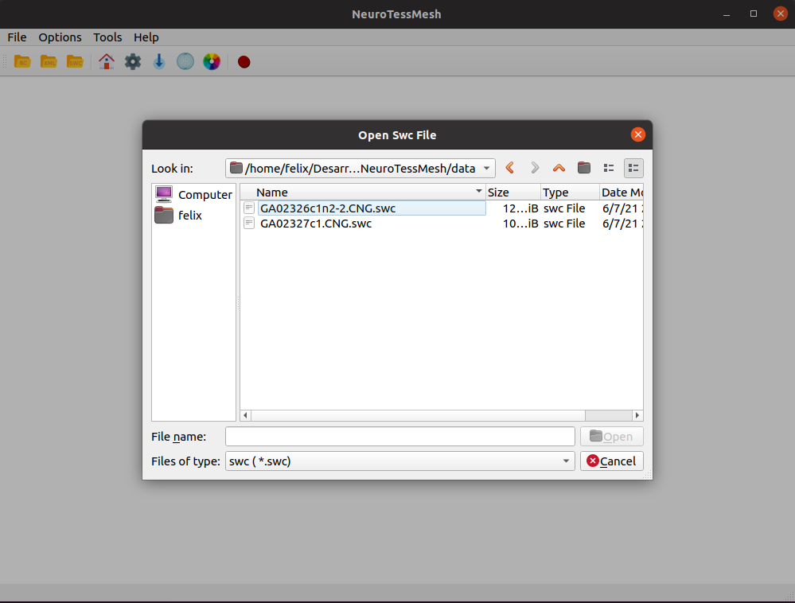
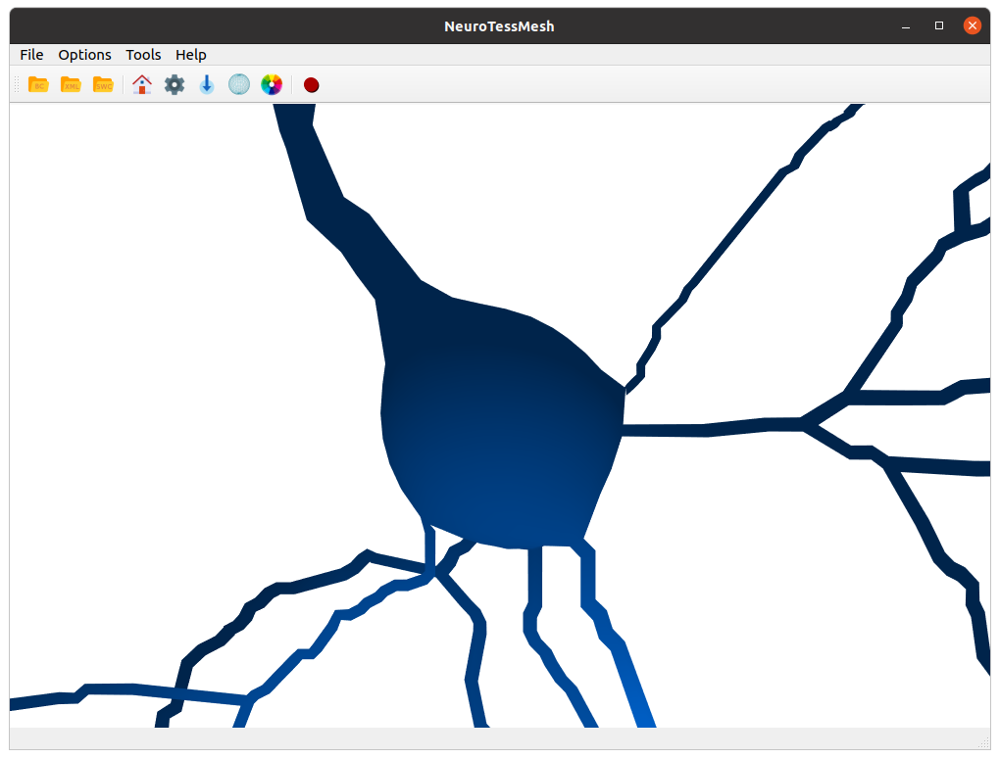
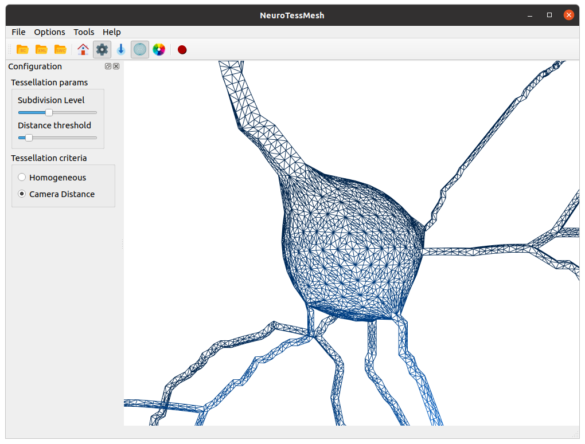
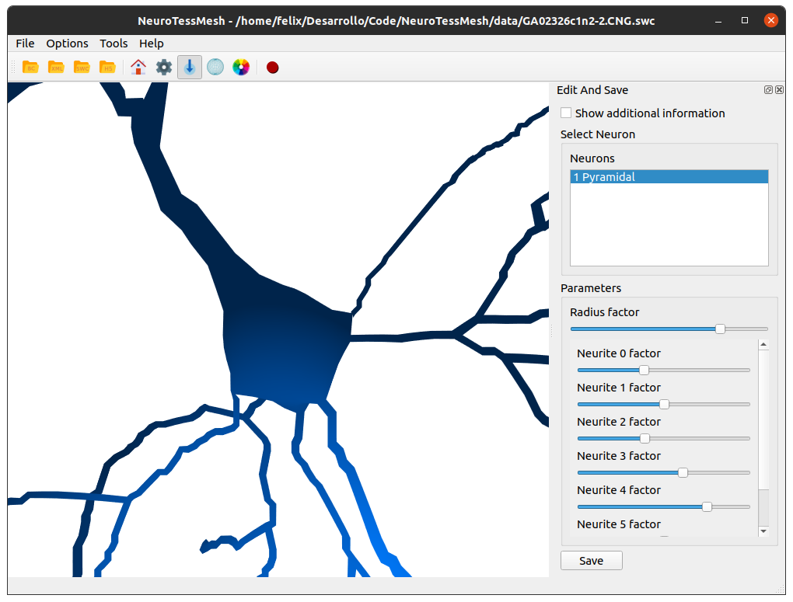
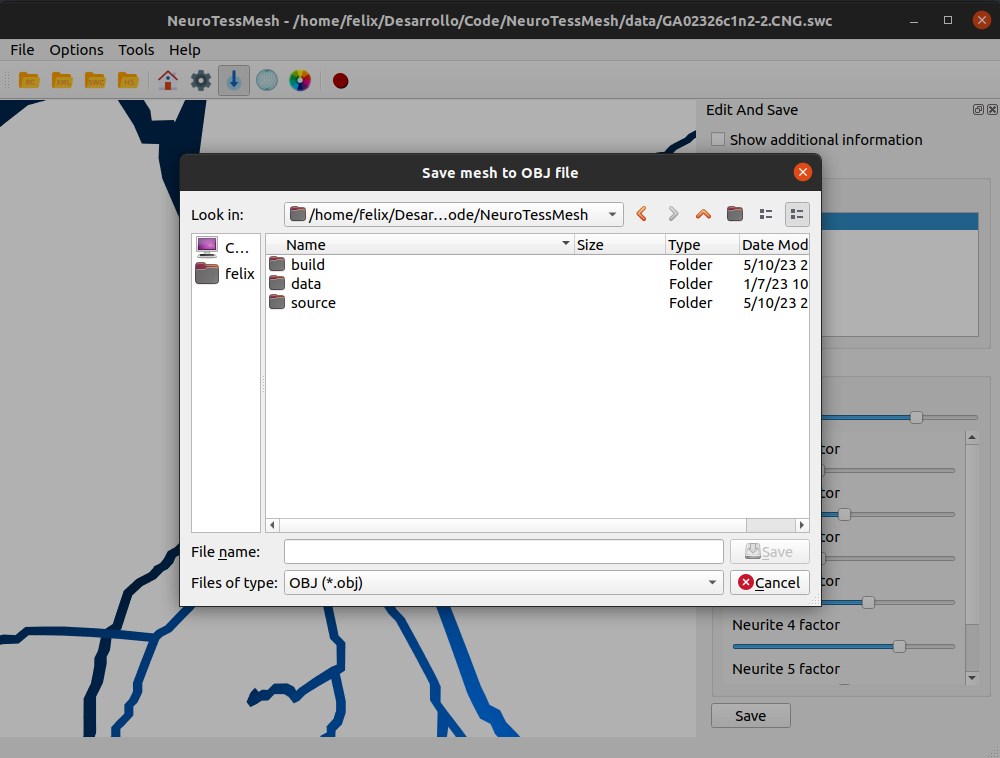

=======
Runbook
=======

.. note::
   This runbook will test the main functionalities of NeuroTessMesh and can be considered as a basic tutorial for the application, but **not** as a complete and exhaustive tutorial of all its functionalities. This runbook is up to date with NeuroTessMesh version 0.4.3 (some images are from version 0.4.0). 

1. Load a "swc" file (:numref:`fig5`). 

.. _fig5:

   Opening a file.
   
.. raw:: latex

    \clearpage   

2. Visualize and navigate through the reconstructed neuronal mesh using the scene camera controls as previously explained in user interface section (:numref:`fig6`).

.. _fig6:

   3D View navigation.
   
.. raw:: latex

    \clearpage   

3. Change the render options. In this example the Subdivision level has been increased to 10, the Distance threshold has been also increased and the Tessellation criteria has been modified to Homogeneous criteria (:numref:`fig7`).

.. _fig7:

   Render options manipulation.
   
.. raw:: latex

    \clearpage

4. Modify the soma reconstruction params. In this example the soma volume has been decreased setting the Radius factor to 0.75 and the starting points of the neurites have been displaced using the Neurite [n] factors (:numref:`fig8`).

.. _fig8:

   Reconstruction parameters manipulation.

.. raw:: latex

    \clearpage
    
5. Save the results to a "obj" file (:numref:`fig9`). 

.. _fig9:

   Save results to file.

  
